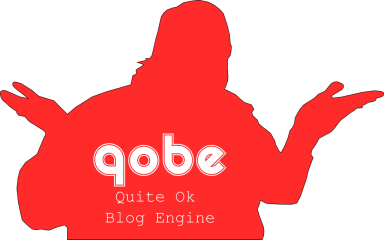

# qobe - Fixed-structure-template-less blog engine




# What is qobe

'qobe' is a fixed structure static blog engine with only one CSS file to customize. So, there is no template language to learn. Features:

- A blog engine in one C++ file
- Compile and run it: `g++ qobe.cpp -o qobe && ./qobe.out ./input ./output`
- First argument is the blog input directory, each article in dedicated subdirectory along with images, named index.md
- Supports YAML header (date and title fields only)
- Supports code highlighting (front-end script)

Blog structure:

```
docs/blog
      | article-1
           |__ index.md
           |__ image1.png

      | article-2
           |__ index.md
           |__ image42.png
```

# Customize

## CSS style

You must provide a `style.css` at the directory root of your blog. If none found, a default one is generated. Generate it first, then customize it.

## Custom header

If a file named `header.html` is found at the directory root of your blog, it will be inseted on top of each pages.

# That's all folks

Yes, no configuration file, it's enough generic for a simple blog. The C++ code has been heavily generated by IA.

